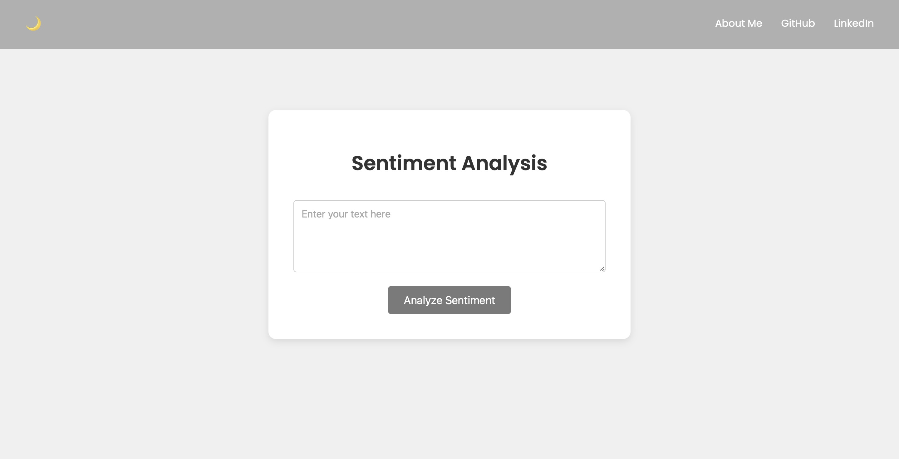

# Sentiment Analysis Web App

This is a **Sentiment Analysis Web App** that allows users to input text and analyze its sentiment (positive, negative, or neutral). It also includes a **dark mode** toggle and an **About Me** section that can be accessed through a modal popup.

## Features

- **Sentiment Analysis**: The app analyzes the sentiment of the input text and displays the sentiment label (positive, negative, or neutral) along with a confidence score.
- **Dark Mode**: The app provides a toggle button to switch between light and dark themes.
- **About Me Modal**: An "About Me" section that opens in a modal, featuring a circular image and personal information. 
- **Prevent Right Click & Text Selection**: The app disables the ability to right-click and select text or images.

## Screenshots




## Technologies Used

- **HTML**: Structure and content of the web page.
- **CSS**: Styling, including responsive design and dark mode.
- **JavaScript**: For interactivity, including the sentiment analysis request, dark mode toggle, and modal functionality.
- **Python (Backend)**: A Flask server (or similar) that processes the sentiment analysis.

## Installation

To run the project locally:

1. Clone the repository to your local machine:
   ```bash
   git clone https://github.com/royanikseresht/sentimentanalysis.git
   ```

2. Navigate to the project folder:
   ```bash
   cd sentimentanalysis
   ```

3. Open the `index.html` file in your browser:
   ```bash
   open index.html  # MacOS
   start index.html # Windows
   xdg-open index.html  # Linux
   ```

4. Ensure the backend is running on `http://127.0.0.1:5000`. You may need to set up a simple backend server using Flask or similar for the sentiment analysis to work.

   Example for Flask:
   ```bash
   pip install flask
   ```

   And create a `app.py`:
   ```python
   from flask import Flask, request, jsonify
   from some_sentiment_analysis_module import analyze_sentiment

   app = Flask(__name__)

   @app.route('/analyze', methods=['POST'])
   def analyze():
       data = request.get_json()
       text = data.get('text')
       sentiment, score = analyze_sentiment(text)
       return jsonify({'label': sentiment, 'score': score})

   if __name__ == '__main__':
       app.run(debug=True)
   ```

## How It Works

### **1. Sentiment Analysis**
The app uses a backend API to perform sentiment analysis. Users input text, which is sent to the backend, and the sentiment label (positive, negative, neutral) along with a confidence score is returned and displayed on the web page.

### **2. Dark Mode Toggle**
The app allows users to toggle between dark and light themes using a button at the top-right corner. This toggle is implemented with JavaScript, and the styles switch between a light mode and dark mode using a `.dark-mode` class.

### **3. About Me Modal**
The "About Me" button opens a modal where users can learn more about the creator of the project. This modal is styled with rounded image and personal information.

### **4. Prevent Right Click and Text Selection**
The app includes JavaScript to disable text selection and right-click functionality to prevent users from copying content.

## Development

### Frontend Development

The frontend is built using:
- **HTML5** for the structure.
- **CSS3** for responsive and theme-based styling.
- **JavaScript** for user interactivity.

### Backend Development

The backend (sentiment analysis) can be built using **Python** and **Flask** or any other backend technology that you prefer. The backend should expose an endpoint (`/analyze`) that accepts text and returns a sentiment label and score.

## Contributing

Feel free to fork this project and submit pull requests for any improvements or bug fixes.

### Steps for contributing:
1. Fork the repository
2. Clone your fork locally
3. Create a feature branch (`git checkout -b feature-branch`)
4. Commit your changes (`git commit -m 'Add feature'`)
5. Push to your branch (`git push origin feature-branch`)
6. Create a pull request

## License

This project is licensed under the MIT License - see the [LICENSE](LICENSE) file for details.
